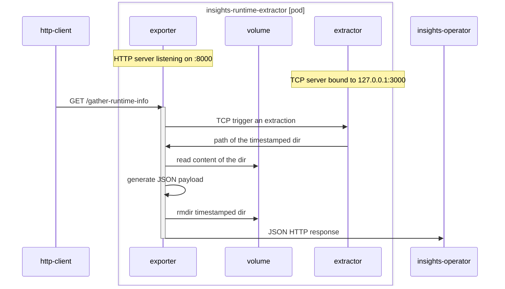

# Insights Runtime Exporter

The exporter is a HTTP server that acts as the facade for the insights-runtime-extractor.

Upon request of a `GET /gather-runtime-info`, it opens a TCP connection to the `extractor` (running on `localhost:3000`)
The `extractor` replies with a directory path that contains the raw runtime information.
The `exported` reads files in that directory and generates a JSON payload that is sent back with the HTTP response
It then deletes the directory that it read from.

# Build

Run `make build` to build the `extractor` executable

# Test

Run `make test` to run the tests

# Design

